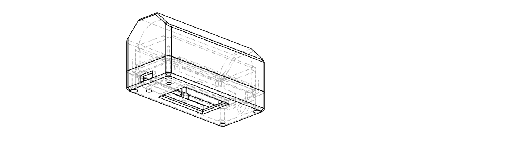

# Heltec V4 + 26650 Case



*Regenerated from `case.py` on every change (see `make preview` below) —
this is always the actual current model, not a stale illustration.*

Parametric [CadQuery](https://cadquery.readthedocs.io/) model of a
3D-printable enclosure (base + face plate, plus a retainer plank and a
button bridge as small separately-printed parts) for:

- A **Heltec V4** board (ESP32-S3 based Heltec WiFi LoRa 32 V4 form factor,
  **GPS-less variant**), including its two tactile buttons (PRG/boot and
  RST), actuated through the plate via a separately-printed bridge (see
  "The two buttons and their bridge" below)
- An **external antenna** connected via an **IPEX-to-SMA pigtail**, with a
  panel-mount SMA bulkhead hole axially through the **plate's own -X end
  wall** (see "Why the SMA mount moved to the plate" below)
- A single **26650** Li-ion cell as the power source

Outer size **80.1 × 35.7 × 42.3 mm**.

## Files

- `case.py` — the model: base, plate, the printable retainer plank and the
  printable button bridge, plus mock solids for the cell, board and SMA
  connector used for fit checks.
- `verify.py` — collision / fit / insertion-path checks (see below).
- `render_preview.py` — renders `docs/preview.png`, the image at the top of
  this file.
- `Makefile` — `make` / `make preview` / `make verify` / `make all` /
  `make clean` (see "Generating the model" below).
- `docs/preview.png` — **checked in**, unlike everything under `output/`.
  It exists purely so this README shows the model's current state without
  anyone having to build it themselves; `make` (the bare, no-argument form)
  regenerates it, and it should be committed alongside any change to
  `case.py`.
- `output/` — generated STL + STEP. Not checked in; regenerate with `make`.

## Design

The enclosure splits along a horizontal parting line **just above the cell**,
closed with **four M2 socket-head cap screws** (M2×16) threaded into printed
bosses. The 26650 cell lies **along the case's long axis, centred directly
underneath the board**.

The two halves divide the job cleanly:

- **Base half — a pure battery tub.** It carries *no* board features at all:
  - A **cradle** for the cell: a pedestal filling the cavity up to the
    cell's axis height, with a half-round bore cut through it. The solid
    blocks past each end of the bore act as axial end stops.
  - A **rectangular insertion shaft** (66 × 27.1 mm) running from the
    widest point of the cradle straight up through the open top, so the
    cell drops vertically into place.
  - Four screw bosses, placed *beyond the ends of the shaft*.
  - **No lip at all** — the wall runs full thickness straight up to a flat
    rim (see "Half-lap interface" below).
  - A large **chamfer on the two long bottom edges**, plus a small break on
    the short ends and on the junctions between them (see below).

- **Plate half — the face plate, and it carries the board.** It has:
  - A **cutout over the whole OLED module** (frame + corner screws, not just
    the glass), sized from the module's dimensioned 33.28 × 18.56 mm
    footprint plus a 0.6 mm margin, sitting 0.5 mm above the module.
  - A **registration shoulder** along both long edges instead of screw
    posts — the real board has no mounting holes anywhere (confirmed against
    the top-view reference photo), so it can't hang from screws. The
    shoulder registers the board's X/Y position and carries its top face,
    attached to both the plate's own wall and its ceiling. What stops the
    board falling back out is a **separate printed retainer plank**,
    installed after the board and screwed to two bosses hanging off the
    shoulder, which presses up against the GPS and battery/solar connector
    housings on the board's underside. Small preload dimples on the
    shoulder take up the Z slack so the board doesn't rattle once the
    retainer is screwed home. See "Board retention" below.
  - Four M2 clearance holes with socket-head counterbores, each over a
    **post** the screw head bears on.
  - A **plug** hanging below the flange that drops into the base cavity.
  - A **panel-mount SMA bulkhead hole** (6.63 mm), axially through the
    plate's own -X end wall, above the cell and past the board's far edge
    (see "Why the SMA mount moved to the plate" below).
  - A **1.5 mm chamfer around the top outer edge**, and a matching **1 mm
    bevel on the face side of the display cutout** (see below).

The **USB-C opening** falls entirely within the plate now that the parting
line sits just above the cell, so cutting it from the base removes nothing.
It is still cut from both halves from one shared cutter, so the opening
survives if the parting line is ever moved.

### The octagonal bottom profile

The **two long** bottom edges of the base are chamfered away, so its end-on
section reads as a truncated octagon: a narrow flat bottom, two sloped
flanks, two vertical sides, and a flat top where the face plate closes it
off.

The large flank is deliberately **long-edges only**. The chamfer exists to
delete material outboard of a *cylinder*, and a cylinder only leaves dead
corners along its length — past its flat end faces there is nothing to
reclaim, and cutting there would just eat into the block that acts as the
cell's axial end stop. The short ends therefore get a small 1.5 mm break
instead, and the four junctions where the large flanks run out against the
end walls get a 1.0 mm break, so nothing around the profile is left sharp.

This is not just cosmetic. The cell is round, so the corners of a
rectangular tub are dead material — the chamfer deletes exactly the wedge
that sits outboard of the cell's curve, without touching any clearance.
(The base is currently 30.2 cm³ with the chamfer; the exact saving vs. an
unchamfered tub shifts slightly as other constants like `CELL_OFFSET_X`
change the case's length — `make verify` prints the current base volume if
you want the live number.)

The chamfer is *derived*, not hardcoded. `_max_chamfer_run()` grows it until
one of two limits binds:

- `MIN_CHAMFER_WALL` (2.2 mm) — material left between the sloped face and
  the cell bore. The pinch is always around Z ≈ 6 mm, where the bore's
  curve outruns the 45° line.
- `MIN_BOTTOM_W` (14 mm) — the flat the case actually stands on.

At the current settings the bottom flat binds first, giving a **10.75 mm
run and rise** with **3.39 mm** of wall still over the bore. Raising
`MIN_BOTTOM_W` gives a tippier but lighter case; the hard ceiling from the
wall limit alone is 11.94 mm.

`_max_end_chamfer_run()` still exists, but as a *guard* rather than a
target: `END_CHAMFER` is a small fixed break, and the derivation only bites
if someone raises it far enough to start eating the bore's end (the pinch
would be at Z = 2.0 mm, where the bore is tangent to the floor). The case
stands on a **77.10 × 14.00 mm** flat.

The four runout junctions are broken with CadQuery's `.chamfer()` via a
`FlankRunoutSelector` — they are the only edges on the part that are
diagonal in Y/Z while holding X constant, which picks them out exactly
without indexing into an edge list that shifts whenever a feature is added.
OCC blends the break into the 2.5 mm corner fillets where the edges meet
them, which is why it removes ~86 mm³ rather than the ~19 mm³ a naive
prism estimate would suggest.

Both chamfers eat the lower corners of the screw bosses — at Z = 0 the
bosses are gone entirely, emerging from the chamfered corner as they rise
and becoming full by Z ≈ 7.5 mm. That is harmless, since the boss pilot hole only
spans Z 21.2–30.1 mm, but `verify.py` checks the material ring around every
pilot hole anyway.

**Printability** is the reason the slope is exactly 45°. `CHAMFER_ASPECT`
is rise/run, and at 1.0 the flank is a 45° overhang off the bed — the usual
unsupported limit. Set it above 1.0 for a steeper, safer wall that saves
less. `verify.py` fails the build if the overhang ever exceeds 45°.

### How shallow can this get? (depth analysis)

*`make verify`'s summary output always has the current live figures; the
table below is regenerated by hand to match, not independently derived, so
re-check it against that output if you change any of the inputs.*

Full Z-stack, base floor to plate top, at the current settings:

| Layer | Height | Hard or soft? |
|---|---|---|
| Floor | 2.00 mm | **Hard** — minimum structural floor |
| Cradle (floor → cell axis) | 13.65 mm | **Hard** — half the cell's own diameter |
| Cell (axis → bore top) | 13.65 mm | **Hard** — the other half |
| Cell top → board underside | 5.90 mm | Soft (coin-cell holder + margin) |
| Board PCB | 1.60 mm | **Hard** — real PCB thickness |
| Ceiling clearance (USB-C) | 3.30 mm | Soft — the tallest top-side component the ceiling actually has to clear (see below for why it's USB-C, not the OLED module) |
| Plate top wall | 2.20 mm | **Hard** — matches `WALL` |
| **Total** | **42.30 mm** | |

**82% of the case's height (34.8 of 42.3 mm) is structurally fixed** — the
cell's own diameter plus the floor, the PCB and the top wall. That's the
real cost of stacking the cell directly under the board rather than beside
it, and it can't be trimmed without shrinking the cell, thinning the walls,
or going back to the side-by-side layout (which trades this compactness
for ~131 mm of length instead — see the design history in this file's git
log if you want that trade the other way).

Of the remaining 20%, one reduction has actually been made:

- **`CELL_TO_BOARD_GAP` was cut from 3.5 mm to 2.5 mm** (saving 1.0 mm off
  the total), sized to exactly what the board-retention screw heads need
  (`M2_HEAD_H` = 2.2 mm) plus a 0.3 mm margin — **not** to any header-pin
  protrusion. This case assumes the board's 2.54 mm GPIO header rows are
  left **unpopulated** (`HEADER_PIN_PROTRUSION = 0`). If your board has
  headers soldered, the pins typically protrude 2–3 mm below the PCB and
  would land inside this gap — raise `HEADER_PIN_PROTRUSION` before
  printing, which flows through to `CELL_TO_BOARD_GAP` automatically and is
  checked by `verify.py`.

Worth flagging: cutting this gap took the clearance between the cell and
the board's *screw heads* specifically (not just the PCB) down to
**0.60 mm** (from 1.60 mm before). That's still positive and enforced by
`verify.py`, but it's thin — if you print with looser tolerances than
`CELL_CLEARANCE` (0.6 mm total) assumes, this is the margin that goes first.

### Why the ceiling no longer clears the OLED module

The OLED module (`OLED_MODULE_THICK`, 5.6 mm measured) is the *tallest*
top-side component on the board — taller than the USB-C connector (3.3 mm)
by a wide margin. An earlier version of this model sized the ceiling to
clear the module with a small gap (`OLED_TOP_GAP`, 0.5 mm) above it, which
meant the ceiling — and so the whole case — carried that extra ~2.3 mm
height just for a component that's already sitting directly under a
through-hole in the top wall (the display window) for its own reasons.

Since the window is already a full through-hole (not a blind pocket), the
module doesn't need headroom under the ceiling at all — it can simply pass
*through* the window and poke out the other side. `PLATE_INNER_H` is now
sized to the tallest component the ceiling *does* still have to clear —
`CEILING_CLEARANCE = max(USB_H, UFL_H)`, currently USB-C at 3.3 mm, flush
against the ceiling with no added gap — and the OLED module is deliberately
left out of that formula. The result: the module pokes `OLED_PROTRUSION`
(0.10 mm) proud of the top wall's own outer face, and the case is 1.2 mm
shorter overall than sizing the ceiling to the module would have required.

`verify.py` checks all three legs of this: the ceiling formula actually
matches `BOARD_TOP_LOCAL + CEILING_CLEARANCE`, USB-C is actually the
tallest of the components the formula considers (so a future part swap that
made u.FL taller wouldn't go unnoticed), and `OLED_PROTRUSION` stays
positive (so a future correction to `OLED_MODULE_THICK` that made the
module *shorter* than USB-C — reintroducing the old recessed-behind-the-
window case — would fail loudly instead of silently wasting height again).
If you measure your own module and it comes out shorter than `USB_H`, this
whole mechanism stops applying and the ceiling should go back to clearing
the module directly, the way it used to.

### Half-lap interface

The two halves meet as a plain half-lap: the base is a flat-rimmed tub with
no lip whatsoever, and the plate carries a plug that drops inside it.

```
————————      plate flange, full outer footprint
——____——      plug, inset to fit the base cavity

||    ||      base wall, plain and full thickness
```

This replaced a tongue-and-skirt joint that split the 2.2 mm wall
lengthwise, and it was as bad to print as it sounds:

| | Thickness | Height | Aspect | Widths @ 0.4 mm |
|---|---|---|---|---|
| Old base tongue | 0.88 mm | 5.0 mm | 5.7:1 | 2.2 |
| Old plate skirt | 1.17 mm | 5.0 mm | 4.3:1 | 2.9 |
| **New plug** | **1.60 mm** | **3.0 mm** | **1.9:1** | **4.0** |

The base's wall is now full `WALL` thickness right to the rim, and the plug
is a free-standing wall that can be sized independently of it. Fit is
`FIT_CLEARANCE` (0.15 mm) per side.

One wrinkle worth knowing if you change these numbers: the plug is inset
well clear of the plate's own 2.2 mm wall, so it cannot hang off it — a
first attempt left the plug as a **second, disconnected solid**. It is
carried instead by a short internal ledge (`PLUG_LEDGE`, 1.5 mm) just below
the board, where the plug's inner face and the ledge's inner face are cut as
one surface. Above the ledge the plate reverts to a thin wall. The plug is
also notched around the base's four screw bosses, which rise to the rim.

### The screws actually clamp something now

The case screws pass through a post in the plate and thread into the boss
below, so the stack is:

```
head seats on the post top ─┐
   counterbore (2.2 mm, the full top wall)
   plate post 11.00 mm   ────┤ M2x16
   ── parting line ──
   base boss   5.00 mm engagement
```

The counterbore is exactly as deep as the plate's top wall, so **the head
bears on the top of the plate's post, not on the wall**. Without that post
there is nothing under the head at all — which is precisely what the
earlier revision shipped: `verify.py` measured **0.00 mm³** of material
under every screw head, and the screws would have pulled straight through
on first tightening. There is now a per-screw seat check, confirmed to fail
if the posts are removed.

The posts also set the screw length: crossing an 11.0 mm post and still
biting needs **M2×16**, not the M2×8 quoted earlier.

### Face plate chamfers

Two separate chamfers, for different reasons:

- **`FACE_CHAMFER` (1.5 mm)** breaks the plate's top outer edge so the case
  doesn't read as a slab. It is applied while the top face is still a plain
  rectangle — *before* the window and counterbores are cut — so the edge
  selection can't accidentally pick those up. It brings the top face to
  83.5 × 32.5 mm, which still leaves the M2 counterbores (outer edge at
  13.75 mm) fully on the flat, with 2.5 mm to spare.

- **`WINDOW_CHAMFER` (1.0 mm)** bevels the display cutout on its **face**
  side, at the same 45° as the perimeter chamfer. The aperture is
  34.48 × 19.76 mm at the inside face (the whole OLED module footprint plus
  margin, not just the glass) and opens out to 36.48 × 21.76 mm at the
  visible surface. With a 2.2 mm top wall that leaves a **1.2 mm straight
  land** behind the aperture.

Putting the bevel on the face side rather than the inside means the hole
**only ever widens with height**. Printed window-up, every layer is
supported by the one below, so there is no overhang anywhere in the
window — unlike an inside flare, which would have to bridge inward across
the opening. `verify.py` asserts this directly by sampling the opening
through the wall and requiring it to widen monotonically.

The bevel is produced with CadQuery's `.chamfer()` on the finished top
edge, so the cutter stays a plain rectangular prism and the aperture is
exactly `OLED_WINDOW_W × OLED_WINDOW_H` by construction. `.faces(">Z").edges()` would
also catch the plate's outer perimeter, so the window's four edges are
isolated with a `BoxSelector` around them. `verify.py` measures the real
opening at both faces rather than trusting any of that.

### Why the board hangs from the plate

This is forced by the geometry, not a style choice. The cell (26.7 mm dia.,
65.2 mm long) is both **wider and longer than the board** (51.0 × 25.6 mm),
so the board's entire footprint is shadowed by the cell — and by the cell's
vertical insertion path above it.

An earlier revision supported the board on rails along the base's side
walls. Those rails reached inward to catch the board's edges, which choked
the opening for the cell — the cell could not be fitted at all without
springing the case apart. Any base-side board support has the same problem:
to touch a board narrower than the cell, it must intrude into the cell's
path. This is also why the board can't be retained on **base-side**
pedestals now that it has no mounting holes (see "Board retention" below) —
the base's own top surface sits below the board's underside anyway, so a
pedestal would have to clear the cell *and* poke up past the parting line.

So the board is mounted to the plate, and the base is left completely
clear. `verify.py` enforces this with `base carries no board-support
features` and `base carries no retainer-support features either` checks.

**Consequences worth knowing:**

- Assembly order is: drop the cell into the base → lift the board up into
  the plate's shoulder from its open underside → hold the retainer plank up
  against the board's underside connectors and screw it to the plate → lower
  the plate (now carrying the board) onto the base → four case screws.
- The board is retained by a shoulder + screwed-on retainer plank (see
  below) rather than screws into the PCB — nothing threads into the board
  itself.
- The GPS/battery/solar connectors sit with **2.70 mm** of clearance to the
  cell, tighter than the coin-cell holder's 6.2 mm since they protrude less
  (`CONN_H` = 3.5 mm vs. the holder's 5.6 mm).

### Board retention: shoulder + screwed-on retainer plank, no PCB holes

The real board (confirmed against `reference/heltec_v4_top.JPG`) has **no
mounting holes anywhere** — the USB-C end is just header pins, two tactile
buttons and the connector. Earlier revisions of this model assumed two
holes there (`BOARD_HOLE_*`, now removed) and hung the board from screw
posts; that assumption never had a source and turned out wrong.

**A first attempt at rail-based retention was broken and got replaced.** It
tried a shoulder plus a lip that ran along both long edges, hooking under
the board's underside once the board was lifted into the plate and slid a
few mm toward the USB-C end. Two things were wrong with it, found by
inspecting the built geometry rather than just the formulas:

- The lip was a **fully disconnected floating solid** — unioned into the
  same compound as the plate but never actually touching it, since it sat
  in the board-thickness gap between the shoulder above and open air
  everywhere else. `verify.py` never caught this because it only checked
  for material being *present* at a probe point, not for that material
  being *attached* to anything.
- The insertion move it depended on was **geometrically impossible**: the
  lip-free lead-in gap was 5 mm, but the board is 51 mm long and the rail
  itself is ~52 mm — there is no X position where a rigid 51 mm board fits
  entirely inside a 5 mm gap. The board would have had to pass through
  solid lip material for the other 46 mm of its length.

The fix keeps the **shoulder** (`RAIL_SHOULDER_INNER_Y` to
`SHOULDER_OUTER_Y`, 10.5–15.65 mm) as pure top-face registration — now built
out to the plate's own wall instead of stopping short of it, so it is
attached on *two* sides (wall + ceiling) rather than hanging from the
ceiling alone as an unsupported rib. The board is lifted straight up into
it from the plate's open underside; nothing about this needs it to slide.

What stops the board falling back out is a **separate printed part**, the
retainer plank (`build_retainer()`), installed *after* the board:

- It's a flat bar, `RETAINER_X0`–`RETAINER_X1` (-12.5 to 34.6 mm) long and
  `RETAINER_WIDTH` (14.8 mm) wide, whose top face sits flush against the
  **undersides of the GPS and battery/solar connector housings** — not the
  bare PCB — at `BOARD_UNDER_Z - CONN_H` (31.70 mm). Because it bears on the
  rigid connector housings rather than trying to hook a 0.3 mm strip of bare
  PCB edge, it needs no snap or flex feature at all.
- Two ears per connector position reach out from the plank's own body (so
  they stay part of the same connected solid, unlike the old lip) to two
  bosses that hang off the *underside of the shoulder itself* — the same
  wall+ceiling-supported structure, just extended down locally at the two
  connector X positions. The bare dead zone between the board's own pocket
  edge and the wall's inner face is only 2.45 mm — too narrow for a free
  round boss, and too narrow to give the retainer's own M2 screw hole
  (2.2 mm clearance) any real wall once centred in it (~0.125 mm/side,
  not printable). `RETAINER_BOSS_RECESS` (1.0 mm) pushes the dead zone's
  outboard edge that much further into the side wall — which is `WALL`
  (2.2 mm) thick there, so 1.2 mm of true outer skin still survives —
  widening the zone to 3.45 mm and the hole's wall to a printable
  ~0.6–0.9 mm/side. Each boss is a block (`RETAINER_EAR_LEN` = 4.0 mm long)
  that exactly fills that (now recessed) gap. Both the ears and the bosses
  are kept as narrow as the screw hardware allows and carry a
  `RETAINER_EAR_FILLET` (0.8 mm) round on their exposed vertical corners —
  the surfaces that actually merge into the wall or ceiling lose nothing
  from the fillet (the union just absorbs it), only the corners facing open
  cavity actually show it.
- The plate's half-lap ledge *and* the plug beneath it are solid right where
  the ears cross them, so both are notched locally at all four ear
  positions (`_retainer_ear_notch()`), the same pattern already used for
  the SMA washer and the four corner screw bosses (which already cut clean
  through the plug's full depth for exactly this reason). An earlier
  version of this notch stopped at the parting line on the theory that the
  plug must stay solid below it for the half-lap fit — true of the plug as
  a *whole*, but wrong here: the retainer is brought up from outside the
  plate's open underside along this same Z path, before the plate is ever
  closed onto the base, so leaving the plug solid there blocked the ears'
  only way in. The corner-boss notches already established that local
  full-depth cuts don't compromise the plug elsewhere; this just applies
  the same fix to the four ear positions too. The notch's outward extent
  stops right at `RETAINER_BOSS_Y1` (the recessed dead-zone edge above, not
  the wall's bare inner face), not past it — an earlier version used a
  symmetric margin that overshot 0.5 mm past that line into the solid outer
  wall, cutting a pocket that was never actually needed to clear anything.
- Because the retainer only ever moves straight up (first by hand, into
  contact with the connectors, then via the screws drawing it flush against
  its bosses), it never has to slide past the board or thread around
  anything — the board's own length is irrelevant to the move.
- **Preload dimples** (`PRELOAD_BUMP_INTERFERENCE`, 0.2 mm) on the shoulder
  are deliberately oversized by that much and get elastically compressed as
  the retainer's screws draw the board up against the shoulder, taking up
  the design's Z slack so it doesn't rattle. `verify.py` gives the
  `plate`/`board` pair a wider, explicitly-bounded tolerance for exactly
  this designed overlap.

The shoulder's own +X end doubles as the board's insertion endstop, which is
what keeps the USB-C connector registered against the case's cutout (see
below).

`verify.py` now checks the plate and the retainer are each a single
connected solid — the specific check that would have caught the old lip —
plus that the retainer actually reaches the connectors' contact height and
that each of its four bosses has real material behind it. This is still a
first-pass mechanical design, not something validated by a real print yet:
worth a test print of the plate + retainer alone (with a scrap board or a
3D-printed board mock) before trusting it for the real hardware.

### Why the case is 80.1 mm long

The insertion shaft spans most of the cavity width, so a screw boss placed
anywhere within its length would stand in the cell's way. `OUTER_L` is
therefore derived so the corner bosses clear the ends of the shaft:

```
OUTER_L = 2 × (CELL_FAR_HALF_LEN + BOSS_END_MARGIN + M2_BOSS_D/2 + SCREW_INSET)
```

This is checked by `verify.py`, so changing the cell or screw parameters
keeps the constraint satisfied automatically. (`CELL_FAR_HALF_LEN` folds in
`CELL_OFFSET_X`, currently 0 — see "The cell offset" below — so this
formula is also what shrank the case a further 6mm once the SMA connector
stopped needing that offset for axial room.)

`SCREW_INSET` itself is no longer a hand-picked constant — it's solved for
the smallest value that still keeps the boss enclosed, which is what
shrank the case from 92.7 mm (the previous, arbitrarily generous 6.0 mm
inset) down to 86.1 mm on its own, before the `CELL_OFFSET_X` change below
took it to 80.1 mm. Two independent constraints compete, and `SCREW_INSET`
takes whichever binds tighter:

- **Corner tangency**: the boss's closest approach to the outside is along
  the corner's 45° diagonal, where the outer profile is the `CORNER_FILLET`
  arc rather than a flat wall. The boss doesn't touch the outer wall (that's
  what `BOSS_OUTER_MARGIN` is for), so every one of its own corners stays
  rounded, and its own reach along that diagonal is a rounded square's
  corner distance (`_boss_diag_reach = √2·(half-width − corner radius) +
  corner radius`), not the flat half-width. Solving for that rounded corner
  to be tangent to the case's own `CORNER_FILLET` arc gives `inset ≈ 2.68
  mm` — but the boss (5.5 mm across) is bigger than a single wall is thick
  (2.2 mm), so it can never *also* be tangent to the inner wall without
  breaching the outer one. This is inherent to the boss/wall proportions,
  not a bug.
- **Counterbore vs. face chamfer** (the one that actually wins, at
  `inset = 3.7 mm`): push the boss out any further and its M2 socket-head
  counterbore starts clipping into the top face's own `FACE_CHAMFER` edge
  break instead of landing on flat material. `verify.py`'s existing `face
  chamfer clears the screw counterbores` check is what originally caught
  this when the corner-tangency value alone was tried.

A dedicated check (`boss + margin backed by material at corner ...`) probes
the built solid directly along each boss's outward diagonal, rather than
trusting either formula.

### Bosses are square with rounded corners, not circles

Every screw boss in this file — the base and plate's corner posts, and the
retainer's own mounting bosses — is built by `_rounded_square_boss()`: a
rectangle with its four vertical corners individually filleted, rather than
a plain cylinder. A corner is only rounded if nothing else in the assembly
touches it there; a corner that sits flush against another solid along its
full length is left sharp instead, so the two merge as a clean flat-on-flat
(or flat-on-sharp-corner) union instead of a fillet arc receding out from
under whatever it's supposed to meet. An earlier, circular-boss version of
the retainer/corner-post merge (see "How the board can be tangent to the
boss" below) rounded *both* mating surfaces uniformly and left a
wafer-thin, barely-attached sliver bridging them wherever the fillet ate
into the real (much smaller) contact margin — visible as a stray fin on the
underside of the lid.

Getting the rule right took two passes. The first pass sharp-cornered the
*entire* corner screw post on its board-facing side, reasoning that the
retainer boss "touches that side." But the retainer boss's contact band
(`RAIL_OUTER_Y`–`RETAINER_BOSS_Y1`, 3.45mm) mostly reaches only the
*middle* of that face — nowhere near either of its two corners, which sit
a full `BOSS_CORNER_FILLET` (1mm) beyond the contact band on each end (at
the merged connector the recessed band's outboard tip does clip ~0.75mm
into that fillet-affected sliver, but a flat box overlapping a convex
fillet doesn't reproduce the tangent-arc degeneracy that motivates keeping
other corners sharp, so the union still comes out a single clean solid).
A flat face
merges cleanly with another flat face regardless of what its own corners,
well outside the contact area, are doing, so the post is fully rounded on
every corner, at every screw position, always (`_screw_boss_sharp_corners()`
now returns nothing, kept as a named function specifically to warn the next
reader off re-adding sharpness there). It's only the **retainer boss's own**
corner — right at the point of contact — that has to stay sharp; see the
"Retainer mounting bosses" loop in `build_plate()`.

The sharp *steps* (not corners) around a retainer boss's perimeter get a
small concave fillet instead, purely for printability rather than fit —
`RETAINER_BOSS_WALL_FILLET` blends the boss into everything it lands on
instead of leaving it a bare block standing off the surrounding surfaces:

- Overhead, where the boss's own inner face meets the wider shoulder —
  `RAIL_SHOULDER_INNER_Y` sits inboard of the boss's own `RAIL_OUTER_Y`, so
  the shoulder overhangs the boss on that side, forming an inward 90° step.
- At each **free** X end, where the boss's end face butts into the plate's
  side wall. The merged end has no such edge — it runs into the corner
  screw post and unions with it instead.
- Where the boss overhangs the ledge/plug below it, `_retainer_ear_notch()`
  used to clear only the retainer's own (narrower) ear width even under
  `merge_corner`, leaving a shelf of un-notched material sitting directly
  under the boss's wider overhang. Since the boss's own union re-covers
  whatever the notch removes there anyway, the notch now matches the boss's
  actual (merge-aware) width, which removes the shelf outright rather than
  needing a fillet for it.

**Boss and pocket are the same rectangle.** `_retainer_pocket_x_range()` is
the single source for both the ear notch and the boss that roofs it, so the
two cannot drift apart. The pocket has to be wider than the *ear* that
passes up through it (`RETAINER_POCKET_MARGIN` per side, sized off
`_retainer_ear_x_range()`), but there was nothing to gain from also leaving
the boss narrower than its own pocket — that only exposed a step of bare
ledge running around the boss's footprint. Growing the boss to the pocket's
width closes it without touching the ear's clearance.

Both of them keep their **outboard** corners square
(`_retainer_pocket_sharp_corners()`). The notch deliberately overshoots the
wall's inner face by a hair, so a *rounded* corner there left a thin
crescent of ledge trapped between the fillet arc and the wall, tapering to
a visible point. Square corners run straight out past the wall face and
leave nothing behind. Only the two inboard corners are rounded — which is
also why `verify.py`'s boss-volume expectation subtracts half the corner
loss it used to.

Every selector is boxed tight to the single edge it means, so the boss's
own vertical corners (already rounded, or deliberately sharp) can't be
caught by the same selection. All of them go into **one** `.fillet()` call:
filleting them one at a time fails outright (`StdFail_NotDone` at every
radius tried, down to 0.1) because these edges meet each other, so whichever
runs second has to terminate its fillet surface into the first's — which
OCCT won't solve. Handed the whole set at once it resolves the shared
corners itself. The radius is pinned by what that solver will actually
accept, which is *not* monotonic: 0.6, 0.5 and 0.3 all fail, 0.4 succeeds.
Re-test it if the boss geometry moves.

**What deliberately stays sharp: the retainer plank's seat.** The ear
notch's top face is the surface the plank lands against, so it is cut by a
plain prism and left dead flat right out to the pocket walls. An earlier
version chamfered that rim — the cutter was grown by the chamfer size first
so the seating cross-section still came out full size, and the ear (narrower
than the pocket) did still seat on flat material — but it left a 45° flare
all the way around the seating plane, which reads as the pocket "rounding
up" into its own walls, and an inward-jutting lip at the top of a pocket is
buying an overhang rather than removing one. Removing it also moved the
`BOSS_WALL_FILLET` solver window (upper limit 0.8 → 0.5), which is a good
illustration of how non-local these fillet-solver limits are.

Every corner screw post (base and plate) also leaves its **outward**
corner sharp — the one nearest the case's own rounded outer corner, i.e.
`(sign(x), sign(y))` in the post's local frame — for the same fillet-vs-
fillet reason: rounding it would make it tangent to the case's own
`CORNER_FILLET` arc, and two rounded surfaces tangent to each other is
exactly the fragile case this whole section exists to avoid. Going sharp
there shrinks the real backing material to the outer wall from ~0.72mm to
~0.31mm (see `SCREW_INSET`'s derivation) without that risk — it doesn't
reach zero, because the counterbore-vs-face-chamfer constraint is what
actually holds `SCREW_INSET` back, not this corner, so closing the gap
further would mean loosening `COUNTERBORE_MARGIN`/`FACE_CHAMFER` instead
(a separate trade-off against the screw head's own seat).

Each post is also wider than the corner it sits in, so it is partly buried
in the two walls there and only its inboard quadrant stands exposed in the
cavity. That leaves two *vertical* internal corners per post — the post's
inboard X face running into the side wall, its inboard Y face running into
the end wall — which `_fillet_post_wall_edges()` blends with
`BOSS_WALL_FILLET`, on the base and the plate alike. The plate's plug notch
is grown by the same amount, so the plug still drops past the base's posts
now that they carry that extra corner material. (Only six of the eight
edges exist on the plate: at the +X posts the retainer boss occupies that
corner and carries its own blend instead.)

The matching *horizontal* junction — where a post's sides meet the floor it
stands on — was tried and reverted. `.fillet()` on that edge set didn't just
round the step, it silently filled in ~26 mm³ of real cavity volume
elsewhere on the solid, found only by diffing the solid before/after; the
call itself raised nothing. The vertical post-to-wall edges above are
well-behaved by comparison (every radius from 0.3 to 0.8 solves cleanly),
but the floor junctions are left unfilleted — not worth the risk for a
printability nicety.

### How the board can be tangent to the boss with zero clearance

`BOARD_CENTER_X_TANGENT` puts the board's chamfered corner **exactly**
tangent to the +X corner screw boss's rounded corner arc — no added margin,
pushing USB-C as close to its cutout as the boss geometrically allows
(1.04mm gap, down from 17.65mm unshifted).

An earlier version used a flat rectangle-vs-circle model (the board's
pocket edge against the boss's inner edge at the boss's own centre Y),
which was too conservative: the board's real corner isn't square, it's cut
by `BOARD_CORNER_CHAMFER`, so the closest approach is along that 45°
diagonal, not a flat edge. Solved in closed form for the shift that puts
the diagonal exactly tangent to the boss's `BOSS_CORNER_FILLET` corner arc
(see the derivation in `case.py`, right above `BOARD_CENTER_X_TANGENT`),
and cross-checked against the real (chamfered) board solid and the real
boss solid by direct boolean intersection: zero overlap at this position, a
real (if tiny) overlap if nudged 0.1mm further — confirming this is
genuinely the limit, not a conservative stand-off short of it. `verify.py`
runs that same pair of probes directly, not just the formula.

Pushing the board this close surfaced two knock-on collisions that had to
be fixed alongside it, both between the **retainer** (a separate physical
part) and features that are safe for the **plate** to merge into but not
safe for a different part to share space with:

- The retainer's own mounting ear (not just the plate's boss) was
  reaching into the corner screw post's footprint. Fixed by making
  `_retainer_ear_x_range()` slide the *whole* ear window back (keeping its
  full length) whenever the plain, centred window would cross into the
  post, rather than only ever widening outward the way the plate's own
  boss safely can.
- The retainer plank's own main body (`RETAINER_X0`/`RETAINER_X1`) reached
  far enough toward the +X end wall to collide with the plug's **short-end**
  ring — solid across the plate's full width near each end wall, the same
  mechanism as the long-edge ledge, just never notched along here. Fixed by
  capping `RETAINER_X1` against that ring's inner boundary instead of
  letting it grow unbounded with `RETAINER_MARGIN`.

Both are exactly the kind of thing `verify.py`'s pairwise collision checks
(`no collision: plate <-> retainer`) exist to catch before they reach a
print.

### The cell offset -- a live parameter, currently unused

`CELL_OFFSET_X` shifts the cell, its bore and its insertion shaft along X
(positive = toward the USB-C/+X end, away from the antenna/-X end), at a
1:2 cost of case length for antenna-side clearance (every mm of offset
grows `OUTER_L` by 2mm, since the outer envelope stays symmetric). It used
to be 3.0mm, sized to give the old axially-mounted SMA connector body room
inside the -X end wall. It's **0mm now** — see "Why the SMA mount moved to
the plate" below for why that room is no longer needed — but the mechanism
is kept, not deleted, in case some future component wants the same trade.
`verify.py` measures the offset off the *built* bore geometry (not just the
formula) and checks it points whichever way `CELL_OFFSET_X`'s sign says it
should, including the degenerate "both ends equal" case at 0.

(The board's own X position moves separately, by `BOARD_CENTER_X` — see
"Board retention" above — to pull the USB-C connector close to the case's
cutout. That's an independent shift for an unrelated reason; it just
happens to use the same axis. It changes anyway when `CELL_OFFSET_X` does,
though, because the +X corner screw boss it's measured against moves with
`OUTER_L`.)

### Adding the SMA connector: real datasheet dimensions

`build_sma_connector()` models the actual bulkhead jack, outward to inward,
all measured off its datasheet rather than estimated:

| Feature | Size |
|---|---|
| Threaded barrel (1/4-36 UNS-2A), mostly exposed outside | Ø6.19–6.33mm major dia. × 13mm long |
| Washer, flush against the wall's inside face | (est) 9.5mm OD × 2mm thick |
| Fixed nut (swaged behind the washer, can't back off) | 8mm across flats × 2mm thick |
| Stiff pigtail stub (before the flexible cable) | Ø4mm × 13mm long |

`SMA_HOLE_D` (the panel clearance hole) is `SMA_THREAD_MAJOR_MAX +
SMA_HOLE_CLEARANCE` = 6.63mm — sized to the real thread, not the old flat
8.4mm guess, and the hole through the wall stays exactly that size (the
wider ledge clearance behind it, see below, is a separate cut that never
touches the wall itself). Neither the washer nor the fixed nut behind it
can pass through a hole that size, which is the point: the connector is
installed from the inside, barrel first, until the washer bottoms out
flush against the wall's inside face — `SMA_WASHER_OUTER_X` is exactly
the wall's inner-face X, zero gap, not offset inward for any reason — with
the fixed nut riding right behind it. The washer's OD isn't on the
datasheet, so it's `(est)`, sized to just clear the nut's own
corner-to-corner distance (`AF/cos(30°)` = 9.24mm for an 8mm hex) since a
narrower washer couldn't physically contact it.

### Why the SMA mount moved to the plate

The connector was originally modelled axially, through the **base's** -X
end wall, with an (est) 7mm guess for how far its body protrudes inward.
Once the real datasheet numbers went in, that guess turned out very wrong:
the connector's rigid stack — washer (2mm) + fixed nut (2mm) + stiff
pigtail stub (13mm) = **17mm** — needs far more depth than
`SMA_CLEAR_DEPTH` (4.75mm with no offset, and even the old 3.0mm offset
only bought 10.75mm) provides there. Keeping it in the base would mean
growing `CELL_OFFSET_X` to roughly 6.1mm just to fit
(`SMA_CLEAR_DEPTH = 2×CELL_OFFSET_X + 4.75`), pushing the case out to
**~92.4mm** — longer than before any of this session's other tightening.

A vertical mount through the top face was tried next and technically fit,
but was rejected in favour of keeping the connector's usual front-facing
orientation. The mount that stuck is axial, through the **plate's own**
portion of the -X end wall instead of the base's -- same orientation as
the original, just carried by the other half. That one change sidesteps
the cell entirely: the plate's whole Z-band sits above `CELL_TOP_Z`, so
unlike a base-mounted hole, axial depth here was never limited by
`SMA_CLEAR_DEPTH` or the cell's near end at all -- only by the board's own
far edge, which is much further away. That's what let `CELL_OFFSET_X` go
to **0** (see above) instead of growing to 6.1mm: **the case is 80.1mm
long now, 6mm shorter than the 86.1mm it would've been just from the other
changes this session, and 12.3mm shorter than the 92.4mm a corrected axial
base mount would have needed.**

Two real constraints replace the old cell-clearance one:

- **The half-lap ledge.** The plate's ledge (`PLUG_LEDGE` tall, `PLUG_WALL`
  thick, inset by `FIT_CLEARANCE`) is solid material right at the wall's
  inner face, for `Z <= PLUG_LEDGE` only — exactly where the washer, flush
  against the wall with no offset, would otherwise collide with it. Rather
  than move the connector to dodge it, `_sma_ledge_notch()` cuts the ledge
  back locally instead, the same pattern `build_plate()` already used to
  let the case screw bosses through the plug. That leaves `SMA_Z` free to
  sit wherever gives the most margin to the plate's own ceiling, not
  pinned between the ledge and the ceiling. (An earlier version of this
  notch started from the wall's *outer* face by mistake, washer-sizing the
  visible panel hole instead of just the ledge behind it — fixed by
  starting the notch at the wall's inner face, so the hole stays exactly
  `SMA_HOLE_D`.)
- **The board's far edge**, now the binding constraint instead of the
  cell: `BOARD_CENTER_X` itself shrank once `OUTER_L` did (it's measured
  against the same +X corner boss, which moved), which pulled the board's
  far edge toward the antenna end. Measured margin is **2.75mm** — tight
  by this file's standards, but `verify.py`'s pairwise collision check
  also confirms zero actual overlap against the real board solid, not just
  this margin number.

This is derived, not hand-tuned: every formula that has to avoid the bore
(`OUTER_L`, the screw-boss clearance check, the end chamfer's wall check)
works off `CELL_FAR_HALF_LEN` — the half-length of whichever side is
actually closer to its wall — rather than assuming the bore is centred, so
raising `CELL_OFFSET_X` again later (if some other component needs it)
flows through automatically.

### The two buttons and their bridge, printed separately

The real board carries two SMD tactile buttons next to the USB-C connector
— silkscreened `PRG` (boot) and `RST` (reset) — confirmed and measured off
`reference/heltec_v4_top.JPG` and `reference/heltec_v4_side.JPG`: a
**4.3 × 3.1mm** footprint, **2.5mm** tall, top-mounted like the OLED/USB-C/
u.FL. Both sit at the same X, `BUTTON_EDGE_GAP_X` (4.8mm) in from the
board's own +X (USB-C) edge, mirrored `BUTTON_Y` (8.15mm) off the
centreline. `build_board()` carries them as mock geometry now, the same way
it already carries the OLED/USB-C/u.FL/GPS/power connector mocks.

Since the plate's ceiling used to be solid plastic directly over them,
`build_plate()` now cuts a small plain actuator hole straight through it
above each button.

What actually presses the buttons is a separate printed part,
`build_button_bridge()` — a **single** piece carrying both actuators
instead of two loose ones: a round post through each ceiling hole, joined
underneath the lid by a flat bracket that reaches down to the real
buttons. Each post is a **constant diameter the whole way up** — no wider
head and no counterbore. A first pass gave each post a wider, recessed cap
(so it couldn't be pushed all the way through, and so it had a
comfortably-sized pressable surface), but that step is an unsupported
overhang under FDM printing no matter which way the part goes: printed
cap-down, the bracket ends up cantilevered off a thin post with nothing
underneath; printed post-down (the orientation that actually suits the
bracket), the cap's own rim still overhangs the narrower post beneath it.
A single diameter removes the overhang either way, and retention no longer
needs a cap catching in a counterbore: the bracket itself, sitting below
the ceiling and wider than the hole everywhere except right at the two
holes, is what stops the post from being pushed straight through — the
same role a rivet's far-side head plays, just on the inside. Each post
also starts at the *same* Z as the bracket's own bottom face rather than
its top, so the two overlap through the bracket's full thickness instead
of only touching at one plane — a more robust union, and it means the
post's round cross-section is present from the very first printed layer.

Both posts are vertical and parallel, so the whole rigid part drops
straight down as one motion during assembly — both posts reach the outer
face at the same moment the bracket sweeps down into the open ceiling
cavity. Simplest done before the board goes in, like the retainer plank,
though nothing about the geometry requires that order.

The bracket can't run straight between the two buttons, though: the USB-C
connector sits flush against the ceiling with zero spare headroom
(`CEILING_CLEARANCE == USB_H`, no added gap), and `BUTTON_CENTER_X` lands
*inside* the connector's own X span — expected, the buttons sit right
beside it on the real board — so a straight Y-running bridge at that X
would cut straight through the connector's body. It has to be dodged
in-plane instead, which is what `BUTTON_SPINE_X` is for: the bracket is a
**C**, two arms running in X from each button out to a spine set back far
enough (`BUTTON_BRIDGE_CLEARANCE`, 1mm) to clear the connector's inner
edge. The arms themselves stay clear the whole way even though they cross
the connector's X range, because they run at `Y = ±BUTTON_Y` (8.15mm) —
well outside the connector's own Y half-span (`USB_W/2`, 4.5mm). Only the
spine, which does cross Y=0, has to duck around it in X.

The bracket's own thickness (`BUTTON_ARM_T`) is pinned by the same 0.8mm
gap the post crosses (`CEILING_CLEARANCE − BUTTON_H`): the post is narrow
enough to rise through the round ceiling hole on its own, but the arms are
a wide footprint sweeping under the *solid* ceiling outside that hole, so
`BUTTON_PLUNGER_TRAVEL + BUTTON_ARM_T` has to stay under that 0.8mm or the
bracket would collide with the ceiling itself — caught directly by
`verify.py`'s pairwise collision check the first time this was built at a
naive 1mm thickness. `BUTTON_ARM_T` is 0.5mm as a result: thin, but it only
ever transmits a light finger-press, not a structural load.

`BUTTON_PLUNGER_TRAVEL` (0.2mm) is a deliberate dead-gap between the
bracket's foot and the real button's top face — present so the bridge
can't preload or permanently depress either switch, at the cost of that
much travel before a press actually registers.

The two posts aren't the same length, either. RST needs to stay reachable
without being so exposed it gets bumped by accident, so it's recessed
`BUTTON_RST_OFFSET` (0.5mm) below the plate's outer face; PRG is the one
actually reached for everyday use (held together with RST for flashing),
so it gets the opposite treatment and sits `BUTTON_PRG_OFFSET` (0.5mm)
proud instead. Both are a per-button adjustment on top of the same shared
`BUTTON_POST_H` baseline — the ceiling hole itself doesn't change, since
it already runs the plate's full depth regardless of how long the post
ends up. Each post's own pressable top edge also gets a `BUTTON_TOP_CHAMFER`
(0.4mm) break, cut with `.chamfer()` after the post is built but before
it's unioned into the rest of the bracket.

`verify.py` checks the bridge is a single connected solid (the same
multi-primitive-union concern the plate/retainer connectivity checks exist
for), that it has zero real collision against every other part — including
the board, which is what actually proves the C-route clears the USB-C
connector rather than just trusting the formula — and that the post/arm
reach stays clear of the registration shoulder.

## Verifying fit

```bash
python3 verify.py
```

This builds base, plate and the retainer plank, plus mock solids for the
cell, the board (PCB + OLED module + USB-C + u.FL on top, GPS +
battery/solar connectors on the underside) and the SMA bulkhead connector
(nut + washer + fixed pigtail stub, mounted axially through the plate's own
-X end wall), then checks:

- **Pairwise collisions** — boolean intersection volume of every pair of
  solids must be ~0.
- **Connectivity** — the plate and the retainer must each come out as a
  single connected solid. This is the check that would have caught the
  earlier rail/lip design's retaining lip, which was a fully disconnected
  floating solid — a pairwise collision/containment check alone can't see
  that, only a solid count can (see "Board retention" above).
- **Insertion path** — the base must not intrude into the insertion shaft
  at all, and the shaft must be wide/long enough and reach the open top.
  The clear opening is also *sampled* at 41 heights above the cradle, so a
  feature that narrows the path anywhere is caught (this is exactly how the
  old rail design was found to be unbuildable).
- **Containment** — each component's bounding box lies inside the case.
- **Support** — probes along the shoulder's span confirm it's present the
  whole way from the antenna end to the USB-C endstop; separate checks
  confirm the retainer actually reaches both underside connectors' contact
  height (not just somewhere nearby with a gap) and that each of its four
  mounting bosses has real backing material, rather than the board or
  retainer floating or falling back out.
- **Bottom and end chamfers** — the large flank stays confined to the long
  edges and the end break stays small, overhangs stay within 45°, enough
  wall is left over the cell bore, the standing flat is usable, and the
  chamfers clear the boss pilot holes. The built solid is
  *sampled* at three heights against each intended profile, the bottom face
  is measured against both, the runout break is confirmed by rebuilding
  without it and comparing volumes, and the material ring around every boss
  pilot hole is checked since the chamfers cut the bosses' lower corners.
- **Face plate chamfers** — the window's real opening is measured at both
  the outer and inside faces, the opening widens monotonically through the
  wall (so the bevel is never an overhang), the aperture leaves a straight
  land and clears the retention rails, and the face chamfer leaves the
  counterbores on the flat without breaching the plate ceiling.
- **Half-lap interface and screw stack** — the base has no lip above the
  parting line, the plug is printable (thickness and aspect ratio) and a
  slip fit, its ledge stays below the board, every screw head has material
  to seat on, and the screw is long enough to cross the plate post and
  still bite into the boss. (Whether the plug fouls the SMA connector's
  stub is covered by the general pairwise collision check now, not a
  dedicated formula.)
- **Design clearances** — cell slack, cell-to-board gap, connector clearance
  over the cell, bosses clearing the shaft, the SMA barrel clearing the
  half-lap ledge, the SMA nut/washer/stub clearing both the ledge and the
  plate ceiling, and the whole connector clearing the board's far edge, the
  board's shifted position clearing the +X corner screw boss, the USB-C
  connector actually sitting close to the case's cutout,
  and the OLED module fitting within the (now larger) window opening.

All checks currently pass. Key measured clearances (run `make verify` for
the live numbers — this table is a hand-maintained snapshot and can drift):

| Clearance | Value |
|---|---|
| Narrowest opening above cradle | 31.30 mm (cell needs 26.70) |
| Cell radial slack in cradle | 0.30 mm |
| Cell axial slack | 1.00 mm |
| Cell top → board underside | 6.20 mm |
| Cell top → GPS/battery/solar connectors | 2.70 mm |
| Boss inner edge vs. shaft +X end | 33.60 vs 33.10 mm |
| SMA washer vs. wall inner face (X) | -37.850 vs -37.850 (flush, 0 gap by design) |
| SMA washer vs. plate ceiling | Z(local)=9.65 vs 9.80 (0.15 mm clear) |
| SMA connector vs. board's far edge | X=-20.85 vs -18.10 (2.75 mm clear) |
| Shoulder inner edge vs. OLED window | 10.50 vs 9.88 mm |
| Shoulder outer edge vs. plate wall | 15.65 vs 15.65 mm (flush, attached) |
| Board pocket edge vs. +X corner boss | 33.30 vs 33.60 mm |
| USB-C connector face vs. inner wall | 1.04 mm (was 17.65 mm before this file's first session — see "How the board can be tangent to the boss with zero clearance" below) |
| Ceiling clearance (USB-C, flush) | 3.30 mm |
| OLED module protrusion past outer face | 0.10 mm |
| Plug wall / depth | 1.60 mm × 3.00 mm (1.9:1) |
| Plug fit clearance | 0.15 mm per side |
| Material under each screw head | 2.63 mm³ |
| Case screw engagement in boss | 5.00 mm |
| Chamfer wall over the cell bore | 3.35 mm (min 2.20) |
| Chamfer overhang | 45.0° (limit 45°) |
| Flat the case stands on | 77.10 × 14.00 mm |
| Long-edge chamfer / end break | 10.85 / 1.50 mm |
| Window aperture (inside face) | 34.48 × 19.76 mm (whole OLED module + margin) |
| Window at face side (bevelled) | 36.46 × 21.74 mm |
| Straight land behind the aperture | 1.20 mm |
| Face chamfer to counterbore | 16.35 vs 16.15 mm |
| Boss + margin backed by material (corner diagonal) | tangent, by construction |

Note that a zero-overlap result alone would also be satisfied by a part
floating in mid-air, which is why the support probes and the
narrowest-opening sampling are there.

## ⚠️ Dimensions you should verify before printing

Board outline (51.0 × 25.6 mm), PCB thickness (1.6 mm), OLED active/module
width (27.28 / 33.28 mm), module height (18.56 mm) and header pitch are
measured directly off `reference/heltec_v4_top.JPG` and
`reference/heltec_v4_side.JPG` (own board, hand-annotated). Everything
marked `(est)` in `case.py` is **not** dimensioned on those photos and is a
best-effort estimate — notably component heights and some connector
positions.

| Constant | What to check |
|---|---|
| `OLED_MODULE_THICK` | OLED module height above the PCB (5.6 mm, measured) — now deliberately excluded from the ceiling height, see "Why the ceiling no longer clears the OLED module"; re-check `OLED_PROTRUSION` stays positive if you change this |
| `OLED_CENTER_X`, `OLED_MODULE_EDGE_GAP` | Where the module sits along the board — cross-checked against the photo's own "17.5mm, USB edge to OLED edge" callout, but only to hand-measurement precision |
| `USB_W`, `USB_H`, `USB_DEPTH` | USB-C body size and position — `USB_H` (3.3 mm) now sets the plate's ceiling height directly, since it's the tallest component the ceiling still has to clear |
| `UFL_FROM_END` | u.FL connector position |
| `SMA_WASHER_OD` | The one connector dimension not on the datasheet — sizes `SMA_NOTCH_R` and how much margin is left to the board's far edge (2.75mm) |
| `CELL_D`, `CELL_L` | Your actual 26650 (varies with wrap / protection PCB) |
| `CONN_W`, `CONN_D`, `CONN_H` | GPS + battery/solar connector mocks — 4.8 × 15.8 × 3.5mm, all now measured off the reference image (not estimated); the battery/solar pair is still modelled as one combined footprint since the photo doesn't resolve the split between the two |
| `RETAINER_WIDTH`, `RETAINER_THICKNESS` | Retainer plank contact pad — sized against `CONN_D`/`CONN_H`, so it only presses on the connector housings, not the bare PCB; re-check if your board's connectors differ |
| `BOARD_CENTER_X`, `BOARD_CENTER_X_TANGENT` | How far the board is shifted toward USB-C — capped at an exact geometric tangent to the +X corner screw boss, no added margin (see "How the board can be tangent to the boss with zero clearance") |
| `BOSS_OUTER_MARGIN`, `COUNTERBORE_MARGIN` | How tightly `SCREW_INSET` is pushed into the corner — printers with looser tolerance than these small margins assume should grow them, which pulls the boss (and the whole case length) back out a bit |
| `CHAMFER_ASPECT`, `MIN_BOTTOM_W` | Bottom chamfer: slope and standing flat |
| `END_CHAMFER`, `PROFILE_EDGE_CHAMFER` | Small breaks on the short ends and the flank runouts |
| `FACE_CHAMFER`, `WINDOW_CHAMFER` | Face plate edge break and display-cutout bevel |
| `PLUG_DEPTH`, `PLUG_WALL`, `PLUG_LEDGE`, `FIT_CLEARANCE` | Half-lap plug geometry and fit |
| `CELL_OFFSET_X` | How far the cell is shifted toward USB-C / away from the antenna |
| `HEADER_PIN_PROTRUSION` | **Set this if your board's GPIO headers are populated** — default assumes unpopulated; see "How shallow can this get?" |

`OLED_ACTIVE_H` is *derived* from the dimensioned active width assuming a
128×64 panel; if your display differs, set it directly.

## Generating the model

```bash
pip install cadquery cairosvg
make            # generate STL/STEP into output/, refresh docs/preview.png
make preview    # just refresh docs/preview.png
make verify     # run verify.py
make all        # generate, refresh the preview, then verify
make clean      # remove output/ (docs/preview.png is untouched -- it's checked in)
```

(`python3 case.py` / `python3 render_preview.py` / `python3 verify.py`
directly also work — the Makefile just saves retyping them, and only
re-runs each step when its inputs have actually changed.)

If you edit `case.py`, run `make` and commit the updated
`docs/preview.png` along with it — that's what keeps the image at the top
of this README honest.

Writes to `output/`:

- `heltec_v4_case_base.stl` / `.step`
- `heltec_v4_case_plate.stl` / `.step`
- `heltec_v4_case_retainer.stl` / `.step` — the third printable part, screwed
  to the plate after the board (see "Board retention" above)
- `heltec_v4_case_button_bridge.stl` / `.step` — the fourth printable part,
  dropped into the plate's two button holes (see "The two buttons and
  their bridge" above)
- `heltec_v4_case_assembly.step` (all four printed parts plus the cell,
  board and SMA connector mocks, for visual review only — not for printing)

## Printing notes

- Print the base cradle-down and the plate window-up. With the board
  support moved off the base, the cradle bore is now a plain half-round
  trough with no overhang beyond its own arc — no support needed.
- The plate's posts print as simple vertical pillars in that orientation.
- The display cutout's bevel is on the face side, so printed window-up the
  opening only widens as it rises — no overhang and no bridging anywhere in
  the window.
- The base is ~24 cm³ of enclosed volume including the cradle pedestal —
  print it with modest infill rather than solid.
- The bottom chamfers print as 45° expanding overhangs straight off the
  bed, so they need no support, but the first layer is only
  77.10 × 14.00 mm — use a brim if adhesion is marginal.
- M2 pilot holes are sized (1.6 mm) for self-tapping M2 screws into
  PLA/PETG; swap in heat-set inserts (and re-check `M2_PILOT_D` /
  `M2_BOSS_D`) for reusable fastening.
- The case screws are **M2×16** — long enough to cross the plate's post and
  bite 5.0 mm into the base boss. The board itself has no screws at all —
  see "Board retention" above.
- The retainer plank takes **four short M2 screws** (`RETAINER_SCREW_ENGAGE`
  = 4.0 mm of pilot depth is enough for something much shorter than the
  case screws, e.g. M2×6) into the four bosses hanging off the plate's
  shoulder. Print the retainer flat, in whatever orientation is convenient —
  it's a separate small part, so it isn't bound to the plate's own
  window-up orientation.
- The SMA connector's own fixed nut clamps it to the plate from the inside
  (see "Adding the SMA connector" above) — no separate jam nut needed on
  the panel side, and `SMA_NUT_AF` is now actually used, for the nut mock's
  hex cross-section.
- The button bridge prints with its flat bracket down on the bed and both
  posts rising straight up — every post is a constant diameter the whole
  way, so there's no overhang anywhere and no support needed. It's a loose
  drop-fit into the plate's two button holes (`BUTTON_HOLE_CLEARANCE`,
  0.3mm diametral), not screwed down.
- **Li-ion safety**: this case has no vent path and no provision for a
  protection circuit or BMS. Use a protected cell, and add a vent hole if
  you intend to leave it charging unattended.
